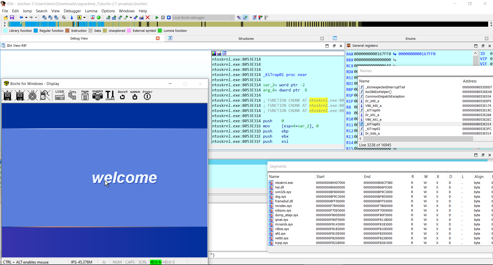
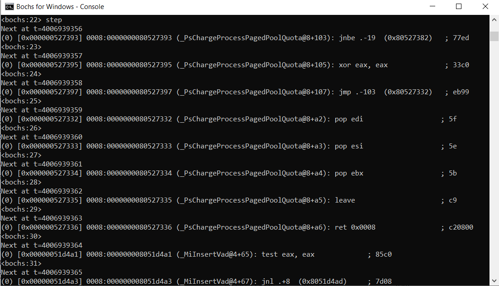
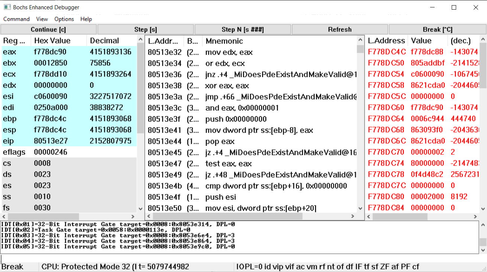

# ida_bochs_windows
Helper script for Windows kernel debugging with IDA Pro on native Bochs debugger (including PDB symbols)

python3 + idapython 7.4

## Export IDA Names to file (for raw Bochs debug)

After ida_bochs_windows.py execution:

Execute ida_names_to_bochs_sym.py

Use the generated file in Bochs debugger (ldsym global + file path):

Bochs debugger GUI:

## Related 

Helper script for Windows kernel debugging with IDA Pro on VMware + GDB stub (including PDB symbols)

https://github.com/therealdreg/ida_vmware_windows_gdb

https://github.com/therealdreg/pdbdump_bochs

## Credits

Based on original IDA-VMware-GDB By Oleksiuk Dmytro (aka Cr4sh) https://github.com/Cr4sh/IDA-VMware-GDB
